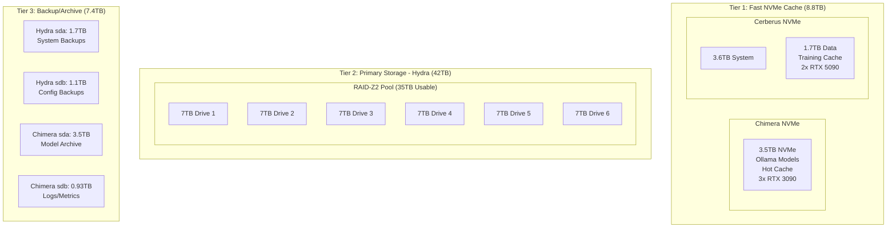

# Hydra RKE2 Cluster Migration - Revised Storage Architecture

## Executive Summary

Utilizing existing 58TB of storage across three servers without additional NAS hardware. Hydra's 42TB (6×7TB drives) becomes the primary storage pool in RAID-Z2, while NVMe drives on Chimera and Cerberus provide fast-tier caching for active workloads.

## Hardware Configuration

**3-Node Cluster:**
- **Hydra**: Control plane + 35TB RAID-Z2 storage (251GB RAM)
- **Chimera**: 3x RTX 3090 (24GB VRAM each = 72GB total) + 3TB NVMe model cache (251GB RAM)
- **Cerberus**: 2x RTX 5090 (32GB VRAM each = 64GB total) + 5TB NVMe training workspace (64GB RAM)

**Total Resources:**
- **RAM**: 566GB (251GB + 251GB + 64GB)
- **Storage**: 58TB (35TB RAID-Z2 + 8.8TB NVMe + 14.2TB backup/archive)  
- **GPUs**: 5x NVIDIA (3x RTX 3090 @ 72GB VRAM, 2x RTX 5090 @ 64GB VRAM)
- **Total VRAM**: 136GB across 5 GPUs

## Revised Storage Architecture

### Storage Tier Distribution



### Detailed Storage Allocation Plan

```yaml
Storage Layout:
  Hydra (Primary Storage Node):
    System Drives:
      /dev/sda: 1.7TB - System + Rancher backups
      /dev/sdb: 1.1TB - Configuration backups + etcd snapshots
    
    Main Storage Pool (RAID-Z2):
      Drives: /dev/sdc through /dev/sdh (6×7TB)
      Raw Capacity: 42TB
      Usable (RAID-Z2): ~35TB
      
      ZFS Dataset Layout:
        tank:                           # Main pool
          /containers: 15TB             # Active student containers
            /active: 8TB                # Running containers
            /inactive: 5TB              # Stopped < 30 days
            /staging: 2TB               # Migration buffer
          /models: 8TB                  # Shared model repository
            /ollama: 5TB                # Ollama models
            /huggingface: 3TB           # HF cache
          /backups: 8TB                 # System backups
            /hydra: 3TB                 # Full system
            /chimera: 2.5TB             # System + configs
            /cerberus: 2.5TB            # System + configs
          /archive: 4TB                 # Long-term storage
            /students: 2TB              # Graduated/old
            /projects: 2TB              # Completed research
  
  Chimera (GPU Inference + Fast Cache):
    Hardware: 3x RTX 3090 (72GB VRAM total), 251GB RAM
    /dev/nvme0n1: 3.5TB
      Partition Layout:
        nvme0n1p1: 500GB - System OS
        nvme0n1p2: 3TB - Fast cache for models
          /cache/models: 2TB            # Frequently used models
          /cache/inference: 1TB         # Inference cache
    
    /dev/sda: 3.5TB - Model archive
      /archive/models: 3TB              # Infrequently used models
      /archive/checkpoints: 500GB       # Training checkpoints
    
    /dev/sdb: 0.93TB - Metrics and logs
      /var/log: 200GB
      /metrics: 730GB                   # Prometheus data
  
  Cerberus (GPU Training + Fast Workspace):
    Hardware: 2x RTX 5090 (64GB VRAM total), 64GB RAM
    /dev/nvme0n1: 3.6TB
      Partition Layout:
        nvme0n1p1: 500GB - System OS
        nvme0n1p2: 3.1TB - Training workspace
          /workspace: 2TB               # Active training
          /datasets: 1.1TB              # Fast dataset access
    
    /dev/nvme1n1: 1.7TB
      /scratch: 1.7TB                   # Temporary training data
```

## GPU Resource Allocation Strategy

### Chimera (Inference Optimized)
**Hardware**: 3x RTX 3090 (24GB VRAM each)
**Use Case**: Ollama inference, multiple concurrent users
**Configuration**:
- **MPS Enabled**: 10 containers per GPU (30 total)
- **Per-container VRAM**: ~2GB (7GB after model load)
- **Model Strategy**: Keep 3-4 popular models in VRAM across GPUs
- **Concurrent Users**: Up to 60 with queuing

### Cerberus (Training Optimized)  
**Hardware**: 2x RTX 5090 (32GB VRAM each)
**Use Case**: Student training jobs, research workloads
**Configuration**:
- **MPS Settings**: 2-3 jobs per GPU max (4-6 total)
- **Per-job VRAM**: ~10-15GB for training
- **Model Strategy**: Load on-demand, evict after completion
- **Priority**: Faculty > Graduate > Undergraduate

## Storage Migration Timeline

### Phase 1: Prepare Hydra Storage (Day 1)
1. Create ZFS RAID-Z2 pool on 6×7TB drives
2. Configure datasets with quotas
3. Setup NFS exports
4. Initialize snapshot schedules

### Phase 2: Configure Fast Tier (Day 2)
1. Setup Chimera NVMe cache
2. Setup Cerberus NVMe workspace
3. Configure tiered caching policies
4. Test model caching

### Phase 3: Deploy Controllers (Day 3)
1. Deploy storage tiering controller
2. Deploy backup controller
3. Configure monitoring
4. Test migration workflows

### Phase 4: Data Migration (Days 4-5)
1. Move existing data to appropriate tiers
2. Migrate models to cache/archive
3. Setup container storage
4. Verify backup/restore

## Expected Storage Utilization

| Location | Total | Allocated | Purpose |
|----------|-------|-----------|---------|
| Hydra RAID-Z2 | 35TB | 35TB | Containers(15TB) + Models(8TB) + Backups(8TB) + Archive(4TB) |
| Hydra sda | 1.7TB | 1.5TB | System backups (compressed) |
| Hydra sdb | 1.1TB | 1TB | Config backups + etcd |
| Chimera NVMe | 3TB | 3TB | Hot model cache |
| Chimera HDD | 3.5TB | 3TB | Model archive |
| Cerberus NVMe | 4.8TB | 4.5TB | Training workspace + scratch |

## Key Optimizations

1. **Compression**: Using LZ4 for active data, ZSTD-9 for backups, ZSTD-15 for archives
2. **Deduplication**: Only on archive dataset to save CPU
3. **Caching**: NVMe tier for frequently accessed models
4. **Network**: Prioritize 10GbE link for large transfers
5. **Snapshots**: Hourly for active, daily for others
6. **Cleanup**: Automatic rotation of old backups and snapshots
7. **GPU Sharing**: MPS for Chimera (inference), larger allocations for Cerberus (training)

This configuration maximizes the use of existing 58TB storage without requiring additional hardware while providing redundancy, performance tiers, and comprehensive backup capabilities.
