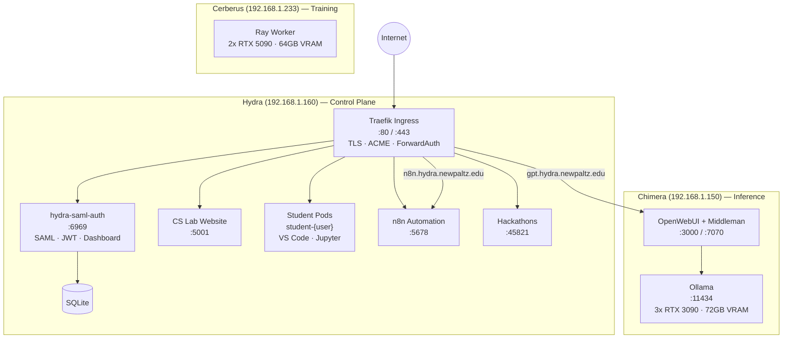

# Hydra SAML Auth

A containerized development platform providing persistent development environments for Computer Science students and faculty, with SAML 2.0 SSO integration via Azure AD.

[](LICENSE)

## Table of Contents

- [Overview](#overview)
- [Live Instance](#live-instance)
- [Docker Hub Images](#docker-hub-images)
- [Features](#features)
- [Architecture](#architecture)
- [Quick Start](#quick-start)
- [Configuration](#configuration)
- [Student Container Features](#student-container-features)
- [Project Structure](#project-structure)
- [Operations](#operations)
- [Documentation](#documentation)
- [Troubleshooting](#troubleshooting)
- [Contributing](#contributing)
- [License](#license)

## Overview

Hydra provides a web-based platform where students can:

1. **Authenticate** via institutional SSO (Azure AD SAML 2.0)
2. **Create** persistent development containers with pre-installed tools
3. **Access** VS Code and Jupyter Notebook directly in the browser
4. **Run** Docker containers inside their environment (Docker-in-Docker)
5. **Expose** custom web applications through dynamic routing

The system handles authentication, container lifecycle management, and routing through Traefik reverse proxy.

## Live Instance

**SUNY New Paltz Production:**

| Service | URL |
|---------|-----|
| Dashboard | [https://hydra.newpaltz.edu/dashboard](https://hydra.newpaltz.edu/dashboard) |
| OpenWebUI (GPT) | [https://gpt.hydra.newpaltz.edu/](https://gpt.hydra.newpaltz.edu/) |
| n8n Automation | [https://n8n.hydra.newpaltz.edu/](https://n8n.hydra.newpaltz.edu/) |
| VS Code | `https://hydra.newpaltz.edu/students/{username}/vscode` |
| Jupyter | `https://hydra.newpaltz.edu/students/{username}/jupyter` |

## Docker Hub Images

Pre-built container images are hosted on Docker Hub for easy deployment across all cluster nodes:

| Image | Description | Size | Link |
|-------|-------------|------|------|
| `ndg8743/hydra-student-container` | Standard student container (Ubuntu 22.04, VS Code, Python, Java, Node.js) | ~4GB | [Docker Hub](https://hub.docker.com/r/ndg8743/hydra-student-container) |
| `ndg8743/hydra-student-container-gpu` | GPU-enabled container (includes CUDA, PyTorch, TensorFlow) | ~20GB | [Docker Hub](https://hub.docker.com/r/ndg8743/hydra-student-container-gpu) |

### Pulling Images

```bash
# Standard container
docker pull ndg8743/hydra-student-container:latest

# GPU container (for Chimera/Cerberus nodes)
docker pull ndg8743/hydra-student-container-gpu:latest
```

### Data Persistence

Student data is stored separately from container images using PersistentVolumeClaims (PVCs):

- **Container Image**: Contains only the base system (OS, tools, VS Code)
- **PVC (`/home/student`)**: Contains all student files, projects, and configurations

This separation means:
- Image updates don't affect student data
- Students keep their files across container restarts
- Data persists even when migrating between nodes (via NFS)

## Features

### Authentication
- **SAML 2.0 SSO** with Azure AD (metadata-driven configuration)
- **JWT Cookies** for cross-service authentication
- **JWKS Endpoint** for JWT verification by downstream services

### Dashboard
- OpenWebUI account management (create/check/change password)
- n8n workflow automation account management
- Container initialization, start/stop, and status monitoring
- Custom port routing configuration
- Real-time logs streaming (Server-Sent Events)
- Web-based terminal access (WebSocket)

### Student Containers
- Single persistent development container per student
- Pre-installed: Node.js, Python 3.11+, Java 21, Docker
- Built-in services: VS Code (code-server) and Jupyter Notebook
- Docker-in-Docker support for running additional containers
- Persistent storage in `/home/student/`

### Routing
- Traefik-based dynamic routing
- Per-user endpoints: `/students/{username}/{endpoint}`
- ForwardAuth protection on all student routes
- Custom port routing via dashboard UI

### Resource Management
- **RAM:** 4GB per container
- **CPU:** 2 cores per container
- **Storage:** Persistent Docker volumes

## Architecture

### 3-Node RKE2 Kubernetes Cluster

The platform runs on RKE2 (Rancher Kubernetes Engine 2) with orchestration mode configurable via `ORCHESTRATOR=kubernetes` environment variable.

| Node | IP | Role | K8s Labels | Resources |
|------|-----|------|------------|-----------|
| **Hydra** | 192.168.1.160 | Control plane, student containers | `hydra.node-role=control-plane` | 256GB RAM, 64 cores, 21TB ZFS |
| **Chimera** | 192.168.1.150 | AI inference (OpenWebUI + Ollama) | `hydra.node-role=inference`, `hydra.gpu-enabled=true` | 3× RTX 3090 (72GB VRAM) |
| **Cerberus** | 192.168.1.233 | GPU training workloads | `hydra.node-role=training`, `hydra.gpu-enabled=true` | 2× RTX 5090 (64GB VRAM) |

### Storage Classes

| Class | Backend | Use Case |
|-------|---------|----------|
| `hydra-local` | Local path on Hydra | Fast local storage for non-GPU workloads |
| `hydra-nfs` | NFS (192.168.1.160:/data/containers) | Cross-node storage for GPU migrations |
| `hydra-hot/warm/cold` | OpenEBS ZFS | Tiered ZFS storage on Hydra |



### Network

- **Hydra**: Hosts Traefik ingress controller (K8s pod with hostPort 80/443), student containers, core services
- **Chimera**: Runs OpenWebUI + Ollama with GPU passthrough for inference
- **Cerberus**: Reserved for GPU training workloads (Ray worker, future vLLM)

Student containers run on Hydra as K8s pods. All external traffic is routed through the Traefik IngressController with ForwardAuth for protected routes.

## Quick Start

### Prerequisites

- Ubuntu 22.04 LTS on all nodes
- SSH access with key-based auth
- sudo/root access
- NVIDIA drivers pre-installed on GPU nodes
- NFS server running on Hydra
- ZFS pool already created on Hydra

### 1. Clone Repository

```bash
git clone https://github.com/compsci-suny-newpaltz/hydra-saml-auth.git
cd hydra-saml-auth
```

### 2. Pull Student Container Images (Recommended)

Images are pre-built and hosted on Docker Hub:

```bash
# Standard container (required for all deployments)
docker pull ndg8743/hydra-student-container:latest

# GPU container (only needed for GPU nodes)
docker pull ndg8743/hydra-student-container-gpu:latest
```

Or build from source:

```bash
cd student-container
docker build -t ndg8743/hydra-student-container:latest .
cd ..
```

### 3. Configure Environment

Create `.env` file:

```bash
# Core Settings
PORT=6969
BASE_URL=https://hydra.yourdomain.edu
COOKIE_DOMAIN=.yourdomain.edu

# SAML Configuration
METADATA_URL=https://login.microsoftonline.com/YOUR_TENANT/federationmetadata/2007-06/federationmetadata.xml
SAML_SP_ENTITY_ID=hydra-auth
SAML_CALLBACK_URL=https://hydra.yourdomain.edu/auth/callback

# Database
DB_PATH=/app/data/webui.db

# JWT Settings
JWT_TTL_SECONDS=86400
JWT_KEY_ID=hydra-key-1
JWT_PRIVATE_KEY_FILE=/app/certs/jwt-private.pem
JWT_PUBLIC_KEY_FILE=/app/certs/jwt-public.pem

# Student Containers
PUBLIC_STUDENTS_BASE=https://hydra.yourdomain.edu/students
```

### 4. Generate JWT Keys

```bash
mkdir -p certs
openssl genrsa -out certs/jwt-private.pem 2048
openssl rsa -in certs/jwt-private.pem -pubout -out certs/jwt-public.pem
```

### 5. Build and Run

```bash
docker compose build
docker compose up -d
```

### 6. Verify

```bash
# Check services
docker compose ps

# Test authentication redirect
curl -I https://hydra.yourdomain.edu/
# Should return 302 to login.microsoftonline.com
```

## Ansible Deployment (Kubernetes)

For deploying the full RKE2 Kubernetes cluster, use the Ansible playbooks in `/ansible/`.

### Install Ansible

```bash
pip install ansible
```

### Update Inventory

Edit `ansible/inventory.yml` with your node IPs:

```yaml
control_plane:
  hosts:
    hydra:
      ansible_host: 192.168.1.160
      node_role: control-plane

gpu_nodes:
  hosts:
    chimera:
      ansible_host: 192.168.1.150
      node_role: inference
    cerberus:
      ansible_host: 192.168.1.233
      node_role: training
```

### Deploy Cluster

```bash
cd ansible

# Test connectivity
ansible -i inventory.yml all -m ping

# Run pre-flight backup (CRITICAL!)
ansible-playbook -i inventory.yml playbooks/00-preflight-backup.yml

# Deploy full cluster
ansible-playbook -i inventory.yml playbooks/site.yml
```

### Step-by-Step Deployment

For more control, run playbooks individually:

```bash
# 1. Prepare nodes (packages, kernel settings)
ansible-playbook -i inventory.yml playbooks/01-prepare-nodes.yml

# 2. Install RKE2 control plane on Hydra
ansible-playbook -i inventory.yml playbooks/02-rke2-server.yml

# 3. Join GPU nodes to cluster
ansible-playbook -i inventory.yml playbooks/03-rke2-agents.yml

# 4. Configure NVIDIA GPU support
ansible-playbook -i inventory.yml playbooks/04-gpu-setup.yml

# 5. Deploy Hydra K8s manifests
ansible-playbook -i inventory.yml playbooks/05-deploy-hydra.yml
```

### Verify Deployment

```bash
export KUBECONFIG=ansible/kubeconfig-hydra.yaml

# Check nodes
kubectl get nodes -o wide

# Check GPU resources
kubectl describe node chimera | grep nvidia
kubectl describe node cerberus | grep nvidia

# Check pods
kubectl get pods -A
```

For detailed Ansible documentation, see [ansible/README.md](ansible/README.md).

## Configuration

### Environment Variables

| Variable | Description | Default |
|----------|-------------|---------|
| `PORT` | Service port | `6969` |
| `BASE_URL` | External URL | Required |
| `COOKIE_DOMAIN` | Cookie scope | Required |
| `METADATA_URL` | Azure AD federation metadata URL | Required |
| `SAML_SP_ENTITY_ID` | SP Entity ID (must match Azure) | Required |
| `SAML_CALLBACK_URL` | SAML callback URL | Required |
| `DB_PATH` | SQLite database path | `/app/data/webui.db` |
| `JWT_TTL_SECONDS` | JWT token lifetime | `86400` |
| `JWT_KEY_ID` | JWT key identifier | `hydra-key-1` |
| `JWT_PRIVATE_KEY_FILE` | JWT signing key path | Required |
| `JWT_PUBLIC_KEY_FILE` | JWT verification key path | Required |
| `PUBLIC_STUDENTS_BASE` | Student URL base | `${BASE_URL}/students` |

### Azure AD Setup

1. Go to **Azure Portal** > **Azure Active Directory** > **Enterprise Applications**
2. Click **New application** > **Create your own application**
3. Name: "Hydra Auth", select "Non-gallery application"
4. Go to **Single sign-on** > **SAML**
5. Set **Identifier (Entity ID)**: `hydra-auth` (must match `SAML_SP_ENTITY_ID`)
6. Set **Reply URL**: `https://hydra.yourdomain.edu/auth/callback`
7. Download **Federation Metadata XML** and note the URL
8. Assign users/groups who should have access

## Student Container Features

### Pre-installed Tools

| Tool | Version | Notes |
|------|---------|-------|
| Node.js | Latest LTS | Via nvm |
| Python | 3.11+ | With pip, venv |
| Java | OpenJDK 21 | - |
| Docker | Latest | Full Docker-in-Docker |
| code-server | Latest | VS Code in browser |
| Jupyter | Latest | Notebook + JupyterLab |
| Git, curl, wget | Latest | Standard tools |

### Default Routes

- **VS Code:** `/students/{username}/vscode`
- **Jupyter:** `/students/{username}/jupyter`

### Custom Services

Students can add custom services via supervisord:

```ini
# ~/supervisor.d/myapp.conf
[program:myapp]
command=/home/student/myapp/start.sh
directory=/home/student/myapp
user=student
autostart=true
autorestart=true
```

### Custom Port Routing

Expose applications through the dashboard:
1. Go to Container tab
2. Click "Add Port Route"
3. Enter endpoint name and internal port
4. Access at `/students/{username}/{endpoint}`

**Reserved ports:** 8443 (VS Code), 8888 (Jupyter)

## Project Structure

```
hydra-saml-auth/
├── index.js                 # Express app: SAML, JWT/JWKS, routes, WebSocket
├── db.js                    # SQLite database initialization
├── routes/
│   ├── containers.js        # Container lifecycle, services, ports, logs
│   ├── webui-api.js         # OpenWebUI account proxy
│   ├── n8n-api.js           # n8n account management
│   ├── servers-api.js       # Cluster status endpoints
│   ├── admin.js             # Admin panel routes
│   ├── resource-requests.js # Resource request handling
│   └── logs-api.js          # Activity logging API
├── services/
│   ├── activity-logger.js   # Activity tracking
│   ├── docker-containers.js # Docker orchestration
│   ├── k8s-containers.js    # Kubernetes orchestration
│   └── email-notifications.js # Email alerts
├── views/                   # EJS templates
├── student-container/
│   ├── Dockerfile           # Ubuntu 22.04 + dev tools
│   ├── supervisord.conf     # Process manager config
│   └── entrypoint.sh        # Container startup
├── config/
│   ├── runtime.js           # Runtime/orchestrator configuration
│   └── resources.js         # Resource presets and node configs
├── ansible/                 # Cluster deployment automation
│   ├── inventory.yml        # Node definitions
│   ├── playbooks/           # Deployment playbooks
│   │   ├── 00-preflight-backup.yml
│   │   ├── 01-prepare-nodes.yml
│   │   ├── 02-rke2-server.yml
│   │   ├── 03-rke2-agents.yml
│   │   ├── 04-gpu-setup.yml
│   │   ├── 05-deploy-hydra.yml
│   │   └── site.yml         # Full deployment
│   └── README.md            # Ansible documentation
├── docker-compose.yaml      # Production stack
├── docs/
│   ├── containers.md        # Container system documentation
│   ├── hydra_infrastructure_guide.tex  # Cluster setup guide
│   ├── hydra_cluster_audit_20260204.tex # Cluster audit report
│   └── compose-backups/     # Backed up Docker Compose files
├── scripts/
│   └── test-routes.sh       # Route health check script
└── README.md
```

## Cluster Operations

### Shell Aliases

Source `~/.hydra-aliases` (auto-loaded in `.bashrc`) for quick management:

```bash
# Quick health check
hydra-test          # Full route health check (all IngressRoutes, K8s, GPUs, RAID)
hydra-health        # Quick cluster status

# Kubernetes shortcuts
k                   # kubectl
kgp                 # kubectl get pods -A
kgs                 # kubectl get svc -A
kgn                 # kubectl get nodes -o wide
kgi                 # kubectl get ingressroute -A

# Namespace shortcuts
ksys                # kubectl -n hydra-system
kstu                # kubectl -n hydra-students
kgpu                # kubectl -n gpu-operator

# Service logs
cslab-logs          # CS Lab backend logs
cslab-db-logs       # CS Lab MariaDB logs
traefik-logs        # Traefik ingress logs
traefik-routes      # List all IngressRoutes

# Student management
students            # List all student pods
student-logs <pod>  # View student container logs

# n8n management
n8n-logs            # n8n container logs
n8n-users           # List all n8n users from PostgreSQL
n8n-restart         # Restart n8n container
n8n-usermgr-logs    # n8n user manager API logs

# Database shells
cslab-db-shell      # MariaDB shell (K8s)
n8n-db-shell        # PostgreSQL shell (Docker)

# GPU
gpu-check           # Show GPU count per node

# Docker (for services not yet migrated)
dps                 # Docker container list
```

### Route Health Check

Run `hydra-test` to verify all services. Expected results:

| Route | Expected | Service |
|-------|----------|---------|
| `/` | 200 | CS Lab Frontend |
| `/dashboard` | 302 | Hydra Auth (redirects to login) |
| `/login` | 302 | SAML SSO redirect |
| `/servers` | 200 | Server status page |
| `/api/courses` | 200 | CS Lab API |
| `/.well-known/jwks.json` | 200 | JWT public keys |
| `/hackathons/` | 200 | Hackathon voting app |
| `/token` | routed | Auth token endpoint |
| `/java/` | routed | Java executor |
| `/git/` | routed | Git learning app |
| `/admin-api/` | routed | Hydra backend (user creation) |
| `gpt.hydra.newpaltz.edu` | 200 | OpenWebUI (Chimera) |
| `n8n.hydra.newpaltz.edu` | 200 | n8n workflow automation |

### Rebuild Main Service

```bash
# K8s deployment (preferred)
kubectl rollout restart deployment/hydra-auth -n hydra-system

# Docker compose (legacy)
docker compose build hydra-saml-auth
docker compose up -d hydra-saml-auth
```

### Rebuild and Push Student Container Images

```bash
# Build the standard container
cd student-container
docker build -t ndg8743/hydra-student-container:latest .

# Build GPU container (if using GPU nodes)
docker build -f Dockerfile.gpu -t ndg8743/hydra-student-container-gpu:latest .

# Push to Docker Hub
docker push ndg8743/hydra-student-container:latest
docker push ndg8743/hydra-student-container-gpu:latest
```

> **Note:** Students with existing containers must recreate them to use the updated image. Student data in `/home/student` is preserved (stored in PVC).

### View Logs

```bash
# Main service
docker compose logs -f hydra-saml-auth

# Student container
docker logs -f student-{username}

# All services
docker compose logs -f
```

### Backup Database

```bash
sqlite3 /app/data/webui.db ".backup '/backups/hydra-$(date +%Y%m%d).db'"
```

## Documentation

- **[Container System](docs/containers.md)** - Architecture, flows, routing details
- **[Infrastructure Guide](docs/hydra_infrastructure_guide.pdf)** - Cluster setup, SSH access, resource management, backups

### Building Documentation

```bash
cd docs
pdflatex hydra_infrastructure_guide.tex
pdflatex hydra_infrastructure_guide.tex  # Run twice for TOC
```

## Troubleshooting

### Authentication Issues

| Symptom | Solution |
|---------|----------|
| SAML assertion invalid | Verify `METADATA_URL` and `SAML_SP_ENTITY_ID` match Azure config exactly |
| Cookie not set | Check `COOKIE_DOMAIN`, ensure HTTPS, check browser settings |
| JWT verification fails | Verify JWKS endpoint accessible, check key files |

### Container Issues

| Symptom | Solution |
|---------|----------|
| Container won't initialize | Verify `hydra-student-container:latest` image exists |
| Container 404 | Check container is on `hydra_students_net`, Traefik running |
| Service won't start | Check supervisord logs inside container |
| Port routing fails | Verify port not reserved (8443, 8888) and not in use |

### Service-Specific Issues

- **VS Code not loading:** Check code-server service, ForwardAuth working
- **Jupyter issues:** Verify `NotebookApp.base_url` setting
- **Docker-in-Docker fails:** Container must have privileged mode
- **Files not persisting:** Only `/home/student/` is persisted

## Contributing

1. Fork the repository
2. Create a feature branch (`git checkout -b feature/amazing-feature`)
3. Commit your changes (`git commit -m 'Add amazing feature'`)
4. Push to the branch (`git push origin feature/amazing-feature`)
5. Open a Pull Request

## License

MIT - see [LICENSE](LICENSE) for details.

---

**SUNY New Paltz Computer Science Department**
