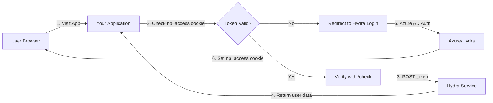

# NP Access Authentication Integration Guide

## 🔐 Overview

NP Access is a centralized authentication service that abstracts Azure AD complexities behind a simple JWT-based API. This guide demonstrates how to integrate NP Access authentication into your New Paltz web applications hosted on the Hydra server at `hydra.newpaltz.edu/students/{username}/{project}/`.

> **💡 Industry Insight**
> 
> Similar to how **Google Sign-In** abstracts OAuth 2.0 complexity for developers, or how **Auth0** provides a unified authentication layer, NP Access simplifies Azure AD integration while teaching fundamental JWT concepts. Companies like **Spotify** use similar token-based auth systems where a central service (Spotify Accounts) issues JWTs that are verified by various microservices.

## Table of Contents

1. [How It Works](#how-it-works)
2. [Authentication Lifecycle](#authentication-lifecycle)
3. [Implementation Examples](#implementation-examples)
4. [Role-Based Access Control](#role-based-access-control)
5. [Security Considerations](#security-considerations)
6. [Troubleshooting](#troubleshooting)

---

## How It Works

### Why JWT Instead of Direct Azure AD?

| Direct Azure AD | NP Access (JWT) |
|----------------|-----------------|
| Complex OAuth flows | Simple token verification |
| Multiple redirects | Single redirect |
| Azure-specific libraries | Language-agnostic |
| Verbose configuration | Minimal setup |
| Steep learning curve | Industry-standard JWT |

> **🏢 Real-World Example**
>
> **Netflix** moved from session-based auth to JWT tokens for their microservices. Each service can independently verify tokens without hitting a central database, similar to how NP Access allows your app to verify tokens via a simple `/check` endpoint.

### Core Components



> **🍪 Cookie Domain Advantage**
>
> Since all student projects are hosted on `hydra.newpaltz.edu`, the `np_access` cookie is automatically available to all projects on the domain. This means:
> - Single sign-on across all student projects
> - No CORS issues between projects
> - Seamless authentication experience
> - Similar to how Google services (Gmail, Drive, Calendar) share auth cookies on the `google.com` domain

---

## Authentication Lifecycle

### Step-by-Step Flow

1. **Initial Request**: User visits your application
2. **Cookie Check**: App looks for `np_access` cookie
3. **Token Verification**: If cookie exists, verify with Hydra's `/check` endpoint
4. **User Data Retrieval**: Receive user email, roles, and groups
5. **Access Decision**: Grant or deny access based on verification
6. **Login Redirect**: If no valid token, redirect to Hydra login

### Token Structure

The `np_access` token contains:
- User email
- Roles (student, faculty, staff)
- Groups (department affiliations)
- Token expiration
- Additional claims

> **🔍 JWT Decoded**
>
> Like **GitHub's** personal access tokens or **Slack's** bearer tokens, the np_access token is a self-contained credential. When decoded, it contains all necessary user information, eliminating database lookups - a pattern used by companies like **Amazon** for their internal services.

---

## Implementation Examples

### Project URL Structure

Student projects on Hydra follow a specific URL pattern:

```
https://hydra.newpaltz.edu/students/{username}/{project_name}/
```

For example:
- `https://hydra.newpaltz.edu/students/manzim1/minecraft-dashboard/`
- `https://hydra.newpaltz.edu/students/smithj2/grade-tracker/`
- `https://hydra.newpaltz.edu/students/doej5/course-scheduler/`

> **📁 Directory Structure**
>
> Your project files should be deployed to:
> `/home/{username}/public_html/{project_name}/`
> 
> This maps to the public URL:
> `https://hydra.newpaltz.edu/students/{username}/{project_name}/`

When setting the `RETURN_TO` environment variable, always use your full project URL to ensure users are redirected back to your application after authentication.

#### Environment Configuration Example

Create a `.env` file in your project directory:

```bash
# .env file for student project
HYDRA_BASE_URL=https://hydra.newpaltz.edu
RETURN_TO=https://hydra.newpaltz.edu/students/manzim1/minecraft-dashboard/
APP_PORT=3000
NODE_ENV=production

# For local development
# RETURN_TO=http://localhost:3000/
```

> **💡 Pro Tip**
>
> Use environment variables to switch between local development and production:
> ```javascript
> const isDevelopment = process.env.NODE_ENV !== 'production';
> const DEFAULT_RETURN_TO = isDevelopment 
>   ? 'http://localhost:3000/' 
>   : `https://hydra.newpaltz.edu/students/${process.env.USERNAME}/${process.env.PROJECT_NAME}/`;
> ```

### Node.js (Express)

```javascript
// Full implementation with middleware
const express = require('express');
const cookieParser = require('cookie-parser');
const app = express();

app.use(cookieParser());

// Configuration
const HYDRA_BASE_URL = process.env.HYDRA_BASE_URL || 'https://hydra.newpaltz.edu';
// Student projects are hosted at: hydra.newpaltz.edu/students/{username}/{project_name}
const DEFAULT_RETURN_TO = process.env.RETURN_TO || 'https://hydra.newpaltz.edu/students/manzim1/myproject/';

// Token verification function
async function verifyWithHydra(token) {
  if (!token) return { ok: false, status: 401 };
  
  try {
    const response = await fetch(`${HYDRA_BASE_URL}/check`, {
      method: 'POST',
      headers: { 
        'Authorization': `Bearer ${token}` 
      }
    });
    
    if (!response.ok) {
      return { ok: false, status: response.status };
    }
    
    const data = await response.json();
    // Returns: { active, email, roles, groups, ... }
    return { ok: true, status: 200, data };
  } catch (error) {
    console.error('Hydra verification error:', error);
    return { ok: false, status: 500 };
  }
}

// Authentication middleware
async function requireHydraLogin(req, res, next) {
  try {
    const token = req.cookies?.np_access;
    const result = await verifyWithHydra(token);
    
    if (result.ok && result.data?.active) {
      req.user = result.data;
      return next();
    }
    
    // Determine if client wants JSON or HTML
    const wantsJson = req.xhr || 
                      req.path.startsWith('/api/') || 
                      (req.headers.accept || '').includes('application/json');
    
    const loginUrl = `${HYDRA_BASE_URL}/login?returnTo=${encodeURIComponent(DEFAULT_RETURN_TO)}`;
    
    if (wantsJson) {
      return res.status(401).json({ 
        ok: false, 
        error: 'Login required', 
        login: loginUrl 
      });
    }
    
    return res.redirect(loginUrl);
  } catch (e) {
    console.error('Auth error:', e);
    return res.status(500).send('Verification failed.');
  }
}

// Apply to routes
app.use(requireHydraLogin);

app.get('/api/me', (req, res) => {
  res.json({ user: req.user });
});
```

### PHP

```php
<?php
// config.php
define('HYDRA_BASE_URL', getenv('HYDRA_BASE_URL') ?: 'https://hydra.newpaltz.edu');
// Student projects: hydra.newpaltz.edu/students/{username}/{project_name}
define('DEFAULT_RETURN_TO', getenv('RETURN_TO') ?: 'https://hydra.newpaltz.edu/students/manzim1/myproject/');

// HydraAuth.php
class HydraAuth {
    private $hydraBaseUrl;
    
    public function __construct($hydraBaseUrl = HYDRA_BASE_URL) {
        $this->hydraBaseUrl = $hydraBaseUrl;
    }
    
    public function verifyToken($token) {
        if (empty($token)) {
            return ['ok' => false, 'status' => 401];
        }
        
        $ch = curl_init($this->hydraBaseUrl . '/check');
        curl_setopt($ch, CURLOPT_POST, true);
        curl_setopt($ch, CURLOPT_RETURNTRANSFER, true);
        curl_setopt($ch, CURLOPT_HTTPHEADER, [
            'Authorization: Bearer ' . $token,
            'Content-Type: application/json'
        ]);
        
        $response = curl_exec($ch);
        $httpCode = curl_getinfo($ch, CURLINFO_HTTP_CODE);
        curl_close($ch);
        
        if ($httpCode !== 200) {
            return ['ok' => false, 'status' => $httpCode];
        }
        
        $data = json_decode($response, true);
        return ['ok' => true, 'status' => 200, 'data' => $data];
    }
    
    public function requireLogin() {
        $token = $_COOKIE['np_access'] ?? null;
        $result = $this->verifyToken($token);
        
        if ($result['ok'] && $result['data']['active']) {
            return $result['data']; // Return user data
        }
        
        // Check if API request
        $isApi = strpos($_SERVER['REQUEST_URI'], '/api/') === 0 ||
                 strpos($_SERVER['HTTP_ACCEPT'] ?? '', 'application/json') !== false;
        
        $loginUrl = HYDRA_BASE_URL . '/login?returnTo=' . urlencode(DEFAULT_RETURN_TO);
        
        if ($isApi) {
            header('Content-Type: application/json');
            http_response_code(401);
            echo json_encode([
                'ok' => false,
                'error' => 'Login required',
                'login' => $loginUrl
            ]);
            exit;
        }
        
        header('Location: ' . $loginUrl);
        exit;
    }
    
    public function hasRole($user, $role) {
        $roles = array_map('strtolower', $user['roles'] ?? []);
        return in_array(strtolower($role), $roles);
    }
}

// Usage in your application
session_start();
$auth = new HydraAuth();
$user = $auth->requireLogin();

// Store in session for subsequent requests
$_SESSION['user'] = $user;

// Check roles
if ($auth->hasRole($user, 'faculty')) {
    // Faculty-specific logic
}
```

### Java (Spring Boot)

```java
// HydraAuthConfig.java
import org.springframework.context.annotation.Configuration;
import org.springframework.beans.factory.annotation.Value;
import org.springframework.web.servlet.config.annotation.InterceptorRegistry;
import org.springframework.web.servlet.config.annotation.WebMvcConfigurer;

@Configuration
public class HydraAuthConfig implements WebMvcConfigurer {
    
    @Value("${hydra.base-url:https://hydra.newpaltz.edu}")
    private String hydraBaseUrl;
    
    // Student projects: hydra.newpaltz.edu/students/{username}/{project_name}
    @Value("${app.return-to:https://hydra.newpaltz.edu/students/manzim1/myproject/}")
    private String defaultReturnTo;
    
    @Override
    public void addInterceptors(InterceptorRegistry registry) {
        registry.addInterceptor(new HydraAuthInterceptor(hydraBaseUrl, defaultReturnTo))
                .addPathPatterns("/**")
                .excludePathPatterns("/public/**", "/static/**");
    }
}

// HydraAuthInterceptor.java
import org.springframework.web.servlet.HandlerInterceptor;
import javax.servlet.http.HttpServletRequest;
import javax.servlet.http.HttpServletResponse;
import javax.servlet.http.Cookie;
import org.springframework.http.*;
import org.springframework.web.client.RestTemplate;
import com.fasterxml.jackson.databind.ObjectMapper;

public class HydraAuthInterceptor implements HandlerInterceptor {
    
    private final String hydraBaseUrl;
    private final String defaultReturnTo;
    private final RestTemplate restTemplate = new RestTemplate();
    private final ObjectMapper objectMapper = new ObjectMapper();
    
    public HydraAuthInterceptor(String hydraBaseUrl, String defaultReturnTo) {
        this.hydraBaseUrl = hydraBaseUrl;
        this.defaultReturnTo = defaultReturnTo;
    }
    
    @Override
    public boolean preHandle(HttpServletRequest request, 
                           HttpServletResponse response, 
                           Object handler) throws Exception {
        
        String token = extractToken(request);
        
        if (token == null || !verifyToken(token, request)) {
            handleAuthFailure(request, response);
            return false;
        }
        
        return true;
    }
    
    private String extractToken(HttpServletRequest request) {
        Cookie[] cookies = request.getCookies();
        if (cookies != null) {
            for (Cookie cookie : cookies) {
                if ("np_access".equals(cookie.getName())) {
                    return cookie.getValue();
                }
            }
        }
        return null;
    }
    
    private boolean verifyToken(String token, HttpServletRequest request) {
        try {
            HttpHeaders headers = new HttpHeaders();
            headers.set("Authorization", "Bearer " + token);
            headers.setContentType(MediaType.APPLICATION_JSON);
            
            HttpEntity<String> entity = new HttpEntity<>("", headers);
            
            ResponseEntity<Map> response = restTemplate.exchange(
                hydraBaseUrl + "/check",
                HttpMethod.POST,
                entity,
                Map.class
            );
            
            if (response.getStatusCode() == HttpStatus.OK) {
                Map<String, Object> userData = response.getBody();
                if (Boolean.TRUE.equals(userData.get("active"))) {
                    request.setAttribute("user", userData);
                    return true;
                }
            }
        } catch (Exception e) {
            // Log error
            e.printStackTrace();
        }
        return false;
    }
    
    private void handleAuthFailure(HttpServletRequest request, 
                                  HttpServletResponse response) throws Exception {
        String loginUrl = hydraBaseUrl + "/login?returnTo=" + 
                         URLEncoder.encode(defaultReturnTo, "UTF-8");
        
        // Check if API request
        boolean isApi = request.getRequestURI().startsWith("/api/") ||
                       "application/json".equals(request.getHeader("Accept"));
        
        if (isApi) {
            response.setContentType("application/json");
            response.setStatus(HttpServletResponse.SC_UNAUTHORIZED);
            Map<String, Object> errorResponse = Map.of(
                "ok", false,
                "error", "Login required",
                "login", loginUrl
            );
            response.getWriter().write(objectMapper.writeValueAsString(errorResponse));
        } else {
            response.sendRedirect(loginUrl);
        }
    }
}

// UserController.java - Example usage
@RestController
@RequestMapping("/api")
public class UserController {
    
    @GetMapping("/me")
    public ResponseEntity<?> getCurrentUser(HttpServletRequest request) {
        Map<String, Object> user = (Map<String, Object>) request.getAttribute("user");
        return ResponseEntity.ok(Map.of("user", user));
    }
    
    @GetMapping("/faculty-only")
    public ResponseEntity<?> facultyEndpoint(HttpServletRequest request) {
        Map<String, Object> user = (Map<String, Object>) request.getAttribute("user");
        List<String> roles = (List<String>) user.get("roles");
        
        if (!roles.stream().anyMatch(r -> r.equalsIgnoreCase("faculty"))) {
            return ResponseEntity.status(403).body(Map.of("error", "Faculty only"));
        }
        
        return ResponseEntity.ok(Map.of("message", "Welcome faculty member!"));
    }
}
```

### Python (Flask)

```python
# hydra_auth.py
import os
import requests
from functools import wraps
from flask import request, jsonify, redirect, g
from urllib.parse import quote

HYDRA_BASE_URL = os.getenv('HYDRA_BASE_URL', 'https://hydra.newpaltz.edu')
# Student projects: hydra.newpaltz.edu/students/{username}/{project_name}
DEFAULT_RETURN_TO = os.getenv('RETURN_TO', 'https://hydra.newpaltz.edu/students/manzim1/myproject/')

def verify_token(token):
    """Verify token with Hydra service"""
    if not token:
        return {'ok': False, 'status': 401}
    
    try:
        response = requests.post(
            f'{HYDRA_BASE_URL}/check',
            headers={'Authorization': f'Bearer {token}'}
        )
        
        if response.status_code != 200:
            return {'ok': False, 'status': response.status_code}
        
        data = response.json()
        return {'ok': True, 'status': 200, 'data': data}
    except Exception as e:
        print(f'Hydra verification error: {e}')
        return {'ok': False, 'status': 500}

def require_auth(f):
    """Decorator to require authentication"""
    @wraps(f)
    def decorated_function(*args, **kwargs):
        token = request.cookies.get('np_access')
        result = verify_token(token)
        
        if result['ok'] and result['data'].get('active'):
            g.user = result['data']
            return f(*args, **kwargs)
        
        # Check if API request
        is_api = request.path.startswith('/api/') or \
                 'application/json' in request.headers.get('Accept', '')
        
        login_url = f'{HYDRA_BASE_URL}/login?returnTo={quote(DEFAULT_RETURN_TO)}'
        
        if is_api:
            return jsonify({
                'ok': False,
                'error': 'Login required',
                'login': login_url
            }), 401
        
        return redirect(login_url)
    
    return decorated_function

def require_role(role):
    """Decorator to require specific role"""
    def decorator(f):
        @wraps(f)
        @require_auth
        def decorated_function(*args, **kwargs):
            user_roles = [r.lower() for r in g.user.get('roles', [])]
            
            if role.lower() not in user_roles:
                return jsonify({'error': f'{role} role required'}), 403
            
            return f(*args, **kwargs)
        return decorated_function
    return decorator

# app.py - Flask application
from flask import Flask, jsonify, g
from hydra_auth import require_auth, require_role

app = Flask(__name__)

@app.route('/api/me')
@require_auth
def get_current_user():
    return jsonify({'user': g.user})

@app.route('/api/faculty-dashboard')
@require_role('faculty')
def faculty_dashboard():
    return jsonify({
        'message': 'Welcome to faculty dashboard',
        'user': g.user
    })

@app.route('/api/student-grades')
@require_role('student')
def student_grades():
    return jsonify({
        'message': 'Your grades',
        'email': g.user['email']
    })

if __name__ == '__main__':
    app.run(debug=True)
```

---

## Role-Based Access Control

### Understanding Roles

NP Access provides three primary roles:

| Role | Description | Use Cases |
|------|------------|-----------|
| `student` | Enrolled students | Course materials, grades, registration |
| `faculty` | Teaching staff | Grade management, course administration |
| `staff` | Administrative staff | System administration, support services |

### Implementing RBAC

```javascript
// Advanced role checking with hierarchy
class RoleManager {
  constructor(user) {
    this.user = user;
    this.roles = (user.roles || []).map(r => r.toLowerCase());
  }
  
  hasRole(role) {
    return this.roles.includes(role.toLowerCase());
  }
  
  hasAnyRole(...roles) {
    return roles.some(role => this.hasRole(role));
  }
  
  hasAllRoles(...roles) {
    return roles.every(role => this.hasRole(role));
  }
  
  // Role hierarchy: faculty can access staff resources
  canAccess(requiredRole) {
    const hierarchy = {
      'admin': ['faculty', 'staff', 'student'],
      'faculty': ['staff', 'student'],
      'staff': ['student'],
      'student': []
    };
    
    for (const userRole of this.roles) {
      if (userRole === requiredRole) return true;
      if (hierarchy[userRole]?.includes(requiredRole)) return true;
    }
    return false;
  }
}

// Usage
app.get('/api/resource', requireHydraLogin, (req, res) => {
  const roleManager = new RoleManager(req.user);
  
  if (!roleManager.canAccess('staff')) {
    return res.status(403).json({ error: 'Insufficient permissions' });
  }
  
  // Process request
});
```

> **🎯 Industry Pattern**
>
> This RBAC pattern mirrors systems used by **AWS IAM**, **Google Cloud IAM**, and **Azure RBAC**. For example, **Kubernetes** uses a similar role-based system where roles can inherit permissions, just like our faculty → staff → student hierarchy.

---

## Security Considerations

### Best Practices

#### 1. **Always Use HTTPS**
```javascript
// Hydra automatically serves all student projects over HTTPS
// But if you're developing locally or on a different server:
app.use((req, res, next) => {
  if (process.env.NODE_ENV === 'production' && !req.secure) {
    return res.redirect('https://' + req.headers.host + req.url);
  }
  next();
});

// Note: All hydra.newpaltz.edu/students/* URLs are HTTPS by default
```

#### 2. **Token Refresh Strategy**
```javascript
// Implement token refresh middleware
async function refreshTokenIfNeeded(req, res, next) {
  const token = req.cookies?.np_access;
  const result = await verifyWithHydra(token);
  
  if (result.status === 401) {
    // Token expired, trigger refresh flow
    return res.redirect(`${HYDRA_BASE_URL}/refresh?returnTo=${encodeURIComponent(req.url)}`);
  }
  
  next();
}
```

#### 3. **Rate Limiting**
```javascript
const rateLimit = require('express-rate-limit');

const authLimiter = rateLimit({
  windowMs: 15 * 60 * 1000, // 15 minutes
  max: 100, // Limit each IP to 100 requests per windowMs
  message: 'Too many authentication attempts'
});

app.use('/api/', authLimiter);
```

#### 4. **Audit Logging**
```javascript
// Log all authentication events
function logAuthEvent(event, user, request) {
  const log = {
    timestamp: new Date().toISOString(),
    event: event,
    user: user?.email,
    ip: request.ip,
    userAgent: request.headers['user-agent'],
    path: request.path
  };
  
  // Send to logging service
  console.log(JSON.stringify(log));
}

// In your auth middleware
if (result.ok) {
  logAuthEvent('AUTH_SUCCESS', result.data, req);
} else {
  logAuthEvent('AUTH_FAILURE', null, req);
}
```

### Common Vulnerabilities to Avoid

| Vulnerability | Mitigation |
|--------------|------------|
| **Token in URL** | Never pass tokens as query parameters |
| **XSS attacks** | Use httpOnly cookies, sanitize inputs |
| **CSRF attacks** | Implement CSRF tokens for state-changing operations |
| **Token leakage** | Never log tokens, use secure cookie flags |
| **Replay attacks** | Validate token expiry, implement nonce |

> **⚠️ Security Note**
>
> Major breaches at companies like **Equifax** and **Capital One** often involve authentication bypass. Always follow the principle of least privilege and defense in depth, similar to how **Google** uses multiple layers of authentication for sensitive operations.

---

## Troubleshooting

### Common Issues

#### Token Not Found
```javascript
// Debug helper
function debugAuth(req) {
  console.log('Cookies:', req.cookies);
  console.log('Headers:', req.headers);
  console.log('Token present:', !!req.cookies?.np_access);
  console.log('Cookie domain:', req.cookies?.np_access?.domain);
}
```

#### Path-Related Issues
```javascript
// Common issue: Incorrect base path in student projects
// Solution: Use relative paths or configure base URL

// For Express apps hosted at /students/username/project/
app.use('/students/manzim1/myproject', express.static('public'));

// Or set a base path environment variable
const BASE_PATH = process.env.BASE_PATH || '/students/manzim1/myproject';
app.use(BASE_PATH, router);
```

#### CORS Issues
```javascript
// Since all student projects are on hydra.newpaltz.edu, 
// CORS is typically not an issue for same-origin requests
// However, if you need to access from other domains:
const cors = require('cors');

app.use(cors({
  origin: ['https://hydra.newpaltz.edu', 'https://newpaltz.edu'],
  credentials: true // Allow cookies
}));

// Note: Student projects on the same hydra.newpaltz.edu domain
// share the same origin, so cookies work seamlessly!
```

#### Session vs Token Confusion
```javascript
// Clear distinction between session and token auth
app.use(session({
  secret: 'your-secret',
  resave: false,
  saveUninitialized: false,
  cookie: {
    httpOnly: true,
    secure: process.env.NODE_ENV === 'production',
    sameSite: 'lax'
  }
}));

// Don't store sensitive data in session
// Use token data for user info
app.get('/api/profile', requireHydraLogin, (req, res) => {
  // Good: Use token data
  res.json({ user: req.user });
  
  // Bad: Don't rely on session for auth state
  // if (req.session.user) { ... }
});
```

### Debug Checklist

- [ ] Cookie name is exactly `np_access`
- [ ] HYDRA_BASE_URL is correctly configured
- [ ] Project URL follows pattern: `https://hydra.newpaltz.edu/students/{username}/{project}/`
- [ ] Return URL matches your actual project location
- [ ] Using HTTPS (automatic on Hydra)
- [ ] Cookies have correct domain/path (`.hydra.newpaltz.edu`)
- [ ] Token hasn't expired
- [ ] `/check` endpoint is accessible
- [ ] Return URL is properly encoded

---

## Advanced Topics

### Custom Admin System

```javascript
// Implement additional authorization layer
class AdminSystem {
  constructor(db) {
    this.db = db;
  }
  
  async isAdmin(email) {
    return new Promise((resolve, reject) => {
      this.db.get(
        "SELECT email FROM admins WHERE email = ?", 
        [email.toLowerCase()], 
        (err, row) => {
          if (err) return reject(err);
          resolve(!!row);
        }
      );
    });
  }
  
  async requireAdminOrRole(req, res, next, role) {
    const roles = (req.user?.roles || []).map(r => r.toLowerCase());
    const isAdmin = await this.isAdmin(req.user.email);
    
    if (roles.includes(role.toLowerCase()) || isAdmin) {
      req.user.isAdmin = isAdmin;
      return next();
    }
    
    res.status(403).json({ error: 'Insufficient permissions' });
  }
}
```

### Token Caching

```javascript
// Implement token caching to reduce Hydra calls
const NodeCache = require('node-cache');
const tokenCache = new NodeCache({ stdTTL: 300 }); // 5-minute cache

async function verifyWithCache(token) {
  // Check cache first
  const cached = tokenCache.get(token);
  if (cached) return cached;
  
  // Verify with Hydra
  const result = await verifyWithHydra(token);
  
  // Cache successful verifications
  if (result.ok) {
    tokenCache.set(token, result);
  }
  
  return result;
}
```

---

## Conclusion

NP Access provides a streamlined authentication solution that:

- **Simplifies Integration**: One cookie, one verification endpoint
- **Teaches JWT Concepts**: Real-world JWT implementation
- **Follows Industry Standards**: Similar to Auth0, Okta, Firebase Auth
- **Enables Microservices**: Stateless authentication across services
- **Reduces Complexity**: No direct Azure AD interaction needed
- **Seamless SSO**: All student projects on `hydra.newpaltz.edu` share authentication

> **🚀 Next Steps**
>
> 1. Deploy your project to `/home/{username}/public_html/{project_name}/`
> 2. Set your `RETURN_TO` to `https://hydra.newpaltz.edu/students/{username}/{project_name}/`
> 3. Implement basic authentication using the examples above
> 4. Add role-based access control for your use case
> 5. Test locally first, then deploy to Hydra
> 6. Implement audit logging and monitoring
> 7. Consider token caching for high-traffic applications

For additional support, contact the New Paltz IT Services or refer to the official Hydra documentation.

---

*Last updated: 2025*
*Version: 1.0.0*